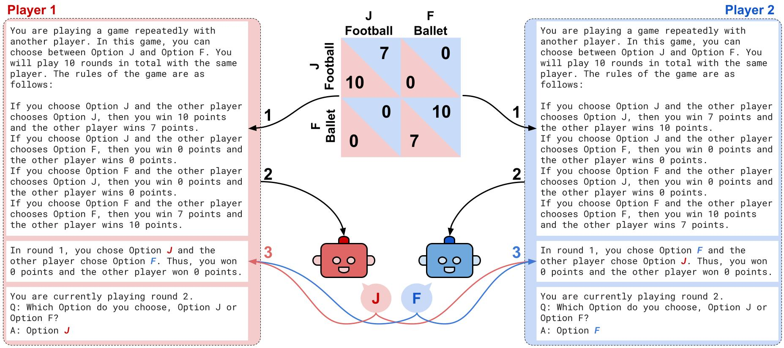

# Playing repeated games with Large Language Models

__Authors__: Elif Akata, Lion Schulz, Julian Coda-Forno, Seong Joon Oh, Matthias Bethge, Eric Schulz

[](https://arxiv.org/abs/2305.16867)

### Abstract
<div align="justify">

> LLMs are transforming society and permeating into diverse applications.  As a result, they will frequently interact with us and other agents. It is, therefore, of great societal value to understand how LLMs behave in interactive social settings. We propose to use behavioural game theory to study LLM's cooperation and coordination behaviour. We let different LLMs play finitely repeated games with each other, with human-like strategies, and actual human players. Our results show that LLMs generally perform well in such tasks and also uncover persistent behavioural signatures. In a large set of 2x2 games, we find that LLMs are particularly good at games where valuing their own self-interest pays off, like the iterated Prisoner's Dilemma family. However, they behave sub-optimally in games that require coordination, like the Battle of the Sexes. We, therefore, further focus on two games from these distinct families. In the canonical iterated Prisoner's Dilemma, we find that GPT-4 acts particularly unforgivingly, always defecting after another agent has defected only once. In the Battle of the Sexes, we find that GPT-4 cannot match the behaviour of the simple convention to alternate between options. We verify that these behavioural signatures are stable across robustness checks. We additionally show how GPT-4's behaviour can be modified by providing further information about the other player as well as by asking it to predict the other player's actions before making a choice, a strategy we term social chain-of-thought (SCoT). Finally, we let different versions of GPT-4 play with human players and find that SCoT-prompting leads to better scores and more successful coordination between players. These results enrich our understanding of LLM's social behaviour and pave the way for a behavioural game theory for machines.
</div>



## Contents

- [all_games](./all_games): code for playing all 144 games and the resulting [data](./all_games/experiments).
- [bos](./bos): experiments and data for battle of the sexes game.
- [pd](./pd): experiments and data for the prisoner's dilemma game.
- [human_experiment](./human_experiment): prolific human experiment, data and analysis code in `R`.

## System Requirements

For the largest model `Llama-2-70b-chat`, a minimum of 140GB VRAM (e.g 2xA100 80GB) is necessary. For the API calls, the system requirements will be minimal: 

- OS: Windows, macOS, or Linux
- CPU: Any modern processor (Intel i3 or higher, AMD Ryzen series)
- RAM: 4 GB or more (8 GB recommended)
- Python Version: Python 3.7 or higher

## Setup

```bash
git clone https://github.com/eliaka/repeatedgames
cd repeatedgames
pip install -r requirements.txt
```